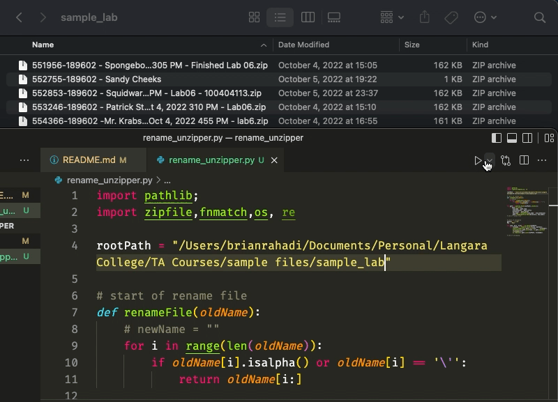

# rename-unzipper
Python script to rename and unzip all students' files

## Why?
As a TA, I find opening the zip submissions of each student quite tedious. This is combined with the files that are not ordered according to the students' names. Therefore, I have developed this simple python script to do all these tasks automatically. It can rename and unzip the files of 35 students in a split of a second.

## How?
Warning: This script only works for MacOS (or maybe other Unix based OS). This script is also mainly used for Langara College submissions where they have numbers first in the file name.
1. Find the working directory of the parent folder of all the students' files. I usually do this by drag-and-dropping this folder to the terminal, type "pwd", and copy it.
2. Assign the working directory as the value of rootPath (line 4 of rename_unzipper.py)
3. Run the python file
4. See magic!

## Notes
Although I programmed this script alone, I took a lot of inspiration for websites, especially all the functions that are imported from os.
